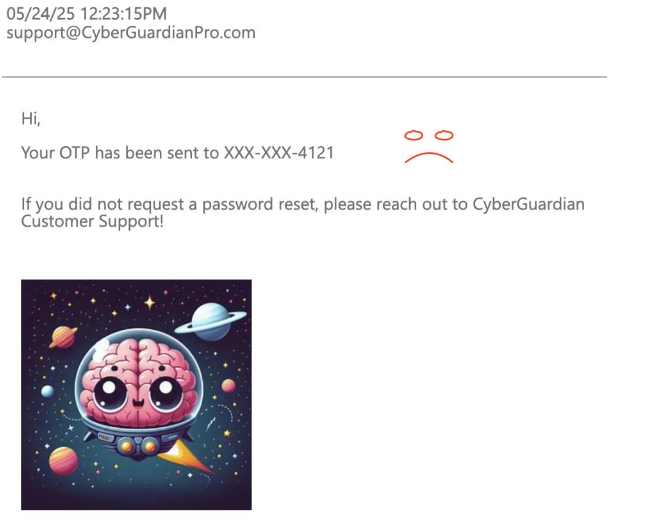

# O5: Take Over an EDR Account

### Files: alg_gen

### Description
Now that you know the EDR tool in use, you've discovered that the best way to take over assets inside of The Lucky Lion is to gain access to the console of the EDR tool. Given the high-privileged rights that EDR Services run as, getting access to this tool should provide unfettered access to The Lucky Lion's resources!

After taking over the email account utilizing their quished credentials, you learned that the administrator is using a different password for accessing the EDR console. (Yay!) However, you've discovered the Java application that The Lucky Lion is utilizing for OTP and you've zipped it up as Alg_Gen.zip (attached in Files). After dissecting the application, it seems to be a promising (albeit disheartening) path!

To get into the EDR console, you'll need to figure out how to take over the credentials for The Lucky Lion's EDR administrator. How can we go about obtaining the credentials for this user?

### Objectives
Provide the One-Time Password from the vendor to reset the user's password.
Required Tools

### IDE Tool:
https://visualstudio.microsoft.com/
https://www.jetbrains.com/idea/
Flag Format 6 digit number Example: 123456

### Additional Resources
Understanding RESTful Calls
https://naveen-metta.medium.com/mastering-restful-api-calls-in-java-a-comprehensive-guide-b777f911002c
Consuming Data from a REST Endpoint
https://spring.io/guides/gs/consuming-rest
Building and Running a Spring Application (Details on how to build and run the application locally)
https://spring.io/guides/gs/rest-service
https://target-httpd.chals.io/webmail/webmail-inbox.html

### Solution
Let us browse throught the alg_gen app source code to understand how the app generates the tokens. In the alg_gen folder, navigate to src > main > java > cs > com > alg_gen > Conrollers > GeneratorController.java. We see a piece of the code that catches our attention:

```java
@GetMapping({"/generate"})
   public String generate_token(@RequestParam(value = "email",required = true) String email) {
      return this.tokenGeneratorService.generate_token();
   }
```

Let us navigate to the `TokenGeneratorService` class to get an idea of what the `generate_token()` function is doing. Navigate to src > main > java > cs > com > alg_gen > Service > TokenGeneratorService:

```java
public String generate_token() {
      return General_Helpers.getTimestamp().replaceAll("[-: ]", "").substring(6, 12);
   }
```

We see that the generate token gets the timestamp from the `General_Helpers` class. Let us once more navigate to the class in src > main > java > cs > com > alg_gen > Helpers > General_Helpers:

```java
public static String getTimestamp() {
      SimpleDateFormat simpleDateFormat = new SimpleDateFormat("yyyy-MM-dd hh:mm a");
      simpleDateFormat.setTimeZone(TimeZone.getTimeZone("CST"));
      return simpleDateFormat.format(new Date());
   }
```

Correlating all of this information we gathered together, we see that the token is generated from the timestamp of when the password request was sent. It is formatted in the `yyyy-MM-dd hh:mm a` format, the token is then generated by formatting the timestamp into `ddhhmm`.

Now that we understand how the token is generated, we will navigate back to the email inbox and look for the email with the password reset:



We correlate the timestamp to the functions:
* `getTimestamp()` - 2024-05-24 12:23:15
* `generate_token()` - when we remove the `-` character, we get 20240524122315 and once we get digits 6 to 12 we get 241223

Flag is `241223`
